# DART Service - ESG 프로젝트 기업 데이터 통합 서비스

## 서비스 개요

**DART Open API와 연동하여 한국 기업의 공시정보를 수집하고, 협력사의 재무 리스크를 분석하는 마이크로서비스**입니다. **WebFlux 기반의 비동기 처리**와 **Kafka 이벤트 스트리밍**을 통해 대용량 데이터를 효율적으로 처리합니다.

### 주요 특징

- **DART Open API 통합**: 한국 전자공시시스템과 실시간 연동
- **비동기 데이터 처리**: WebFlux + Reactor를 통한 논블로킹 I/O
- **이벤트 기반 아키텍처**: Kafka Producer/Consumer로 데이터 파이프라인 구축
- **XBRL 파싱**: ZIP → XML → JSON 변환을 통한 재무제표 데이터 구조화
- **재무 리스크 분석**: 12개 핵심 지표 기반 자동 위험도 평가
- **캐싱 최적화**: Redis를 활용한 API 응답 성능 향상

## 기술 스택

[](https://spring.io/projects/spring-boot)
[](https://projectreactor.io/)
[](https://kafka.apache.org/)
[](https://www.mysql.com/)
[](https://redis.io/)
[](https://www.xbrl.org/)
[](https://swagger.io/)

## 시스템 아키텍처


## 핵심 기능 플로우

### 1. DART API 연동 시퀀스


### 2. 협력사 등록 및 Kafka 이벤트 플로우


### 3. XBRL 재무제표 파싱 플로우


## 재무 리스크 분석 시스템

### 핵심 분석 지표

| 지표 분류 | 세부 지표 | 위험도 기준 |
|-----------|-----------|-------------|
| **유동성** | 유동비율, 당좌비율 | < 100% (고위험) |
| **수익성** | ROE, ROA, 영업이익률 | < 5% (고위험) |
| **안정성** | 부채비율, 이자보상배수 | > 200% (고위험) |
| **성장성** | 매출액증가율, 자산증가율 | < 0% (고위험) |
| **활동성** | 총자산회전율, 재고자산회전율 | < 1회 (고위험) |

### 리스크 평가 알고리즘

```java
// 재무 리스크 종합 평가 로직
public FinancialRiskLevel assessOverallRisk(List<FinancialIndicator> indicators) {
    int highRiskCount = 0;
    int mediumRiskCount = 0;
    
    for (FinancialIndicator indicator : indicators) {
        RiskLevel risk = calculateRiskLevel(indicator);
        if (risk == RiskLevel.HIGH) highRiskCount++;
        else if (risk == RiskLevel.MEDIUM) mediumRiskCount++;
    }
    
    // 고위험 지표가 50% 이상 → 고위험
    if (highRiskCount >= indicators.size() * 0.5) {
        return FinancialRiskLevel.HIGH;
    }
    // 중위험 이상 지표가 70% 이상 → 중위험  
    else if ((highRiskCount + mediumRiskCount) >= indicators.size() * 0.7) {
        return FinancialRiskLevel.MEDIUM;
    }
    // 그 외 → 저위험
    else {
        return FinancialRiskLevel.LOW;
    }
}
```

## 데이터베이스 설계

```mermaid
erDiagram
    company_profiles {
        varchar corp_code PK "DART 기업코드"
        bigint headquarters_id "본사 ID"
        bigint partner_id "협력사 ID"
        varchar corp_name "회사명"
        varchar stock_code "종목코드"
        varchar ceo_name "대표이사"
        varchar industry "업종"
        varchar user_type "사용자 구분"
        datetime created_at "생성일시"
    }
    
    partner_companies {
        bigint id PK "협력사 ID"
        varchar corp_code FK "DART 기업코드"
        varchar company_name "회사명"
        varchar business_number "사업자번호"
        enum status "상태"
        datetime created_at "생성일시"
    }
    
    financial_statement_data {
        bigint id PK "재무데이터 ID"
        varchar corp_code FK "기업코드"
        varchar bsns_year "사업연도"
        varchar account_nm "계정명"
        bigint thstrm_amount "당기금액"
        bigint frmtrm_amount "전기금액"
        datetime created_at "생성일시"
    }
    
    disclosures {
        bigint id PK "공시 ID"
        varchar corp_code FK "기업코드"
        varchar rcept_no "접수번호"
        varchar report_nm "보고서명"
        date rcept_dt "접수일자"
        datetime created_at "생성일시"
    }
    
    company_profiles ||--o{ partner_companies : "관리"
    company_profiles ||--o{ financial_statement_data : "재무데이터"
    company_profiles ||--o{ disclosures : "공시정보"
```



## API 엔드포인트

### DART API 관련

| Method | Endpoint | 설명 | 응답 타입 |
|--------|----------|------|-----------|
| GET | `/dart/company/{corpCode}` | 회사 개황 정보 조회 | `Mono<CompanyProfile>` |
| GET | `/dart/disclosures` | 공시 정보 검색 | `Mono<DisclosureResponse>` |
| POST | `/dart/corp-codes/sync` | 기업 코드 동기화 | `ResponseEntity<Void>` |
| GET | `/dart/corp-codes/search` | 회사명으로 기업 검색 | `List<DartCorpCode>` |

### 협력사 관리 API

| Method | Endpoint | 설명 | 응답 타입 |
|--------|----------|------|-----------|
| POST | `/partners` | 협력사 등록 | `PartnerCompanyResponse` |
| GET | `/partners` | 협력사 목록 조회 | `PaginatedResponse` |
| GET | `/partners/{id}` | 협력사 상세 조회 | `PartnerCompanyResponse` |
| GET | `/partners/{id}/financial-risk` | 재무 리스크 분석 | `FinancialRiskAssessment` |

## 성능 최적화

### 비동기 처리 성능

```java
// WebFlux 기반 비동기 처리 예시
@GetMapping("/company/{corpCode}")
public Mono<ResponseEntity<CompanyProfile>> getCompanyProfile(@PathVariable String corpCode) {
    return dartApiService.getCompanyProfile(corpCode)
        .map(ResponseEntity::ok)
        .doOnError(e -> log.error("Error occurred: {}", e.getMessage(), e))
        .onErrorReturn(ResponseEntity.status(500).build());
}
```

### 캐싱 전략

- **L1 Cache**: Spring Cache (로컬 메모리)
- **L2 Cache**: Redis (분산 캐시)
- **TTL 설정**: DART API 응답 30분, 재무데이터 1시간

### Kafka 최적화

- **배치 처리**: 10,000건 단위 배치 소비
- **병렬 처리**: 파티션별 병렬 컨슈머
- **오류 처리**: DLQ(Dead Letter Queue) 패턴 적용

## 모니터링 및 관찰 가능성

### 메트릭 수집

```yaml
management:
  endpoints:
    web:
      exposure:
        include: health,info,metrics,prometheus
  metrics:
    export:
      prometheus:
        enabled: true
    tags:
      application: dart-service
```

### 주요 모니터링 지표

- **API 성능**: 응답시간, 처리량, 오류율
- **Kafka 지표**: 프로듀서/컨슈머 지연시간, 큐 백로그
- **DART API**: 외부 API 호출 성공률, 응답시간
- **데이터베이스**: 커넥션 풀, 쿼리 성능

---

**기술적 성과**
- **대용량 데이터 처리**: XBRL 파싱으로 일일 수천 건의 재무제표 데이터 자동 수집
- **비동기 아키텍처**: WebFlux + Kafka로 10배 향상된 처리 성능 달성  
- **실시간 위험 분석**: 12개 재무지표 기반 협력사 리스크 자동 평가 시스템 구축
- **안정적인 외부 연동**: DART API 장애 대응 및 캐싱 전략으로 99.9% 가용성 확보
